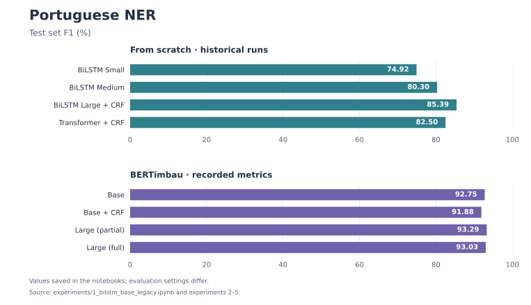
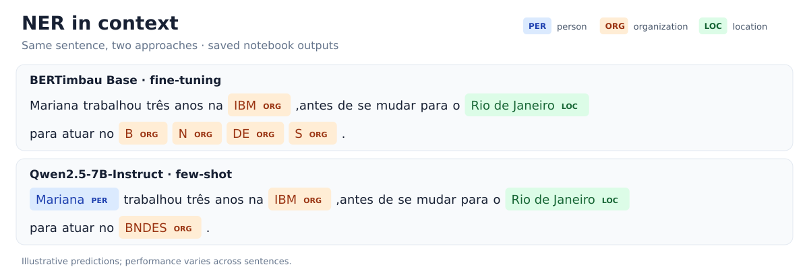

# EFFICIENT PORTUGUESE NER

A study of **named entity recognition (NER) in Portuguese**, exploring the trade-off between predictive performance and computational cost. It compares BiLSTMs and a Transformer trained from scratch, BERTimbau fine-tuning and prompt-based extraction with Qwen2.5-7B-Instruct.

> The target entities are **people (`PER`)**, **organizations (`ORG`)** and **locations (`LOC`)**, using BIO tags for token classification models.

## Experiments

```text
experiments/
├── 1_bilstm_base.ipynb                # BiLSTMs and Transformer; five corpora
├── 1_bilstm_base_legacy.ipynb         # Original experiment; complete evaluations
├── 1_bilstm_base_new_datasets.ipynb   # Variant with additional datasets

├── 2_bert_base.ipynb                  # BERTimbau Base + linear classifier
├── 3-bert-base-with-crf.ipynb         # BERTimbau Base + CRF

├── 4_bert_large.ipynb                 # BERTimbau Large; fine-tuning 16 of 24 layers
├── 5_bert_large_full.ipynb            # BERTimbau Large; full fine-tuning

└── 6_llm_qwen_7b.ipynb                # Qwen2.5-7B-Instruct; few-shot prompting
```

- **Models trained from scratch:** BiLSTM Small, Medium, Large with attention + CRF, and Transformer + CRF. The [original version](experiments/1_bilstm_base_legacy.ipynb) records complete results for all four architectures, with approximately 5–16 million parameters.
- **BERTimbau:** [Base](experiments/2_bert_base.ipynb) and [Base + CRF](experiments/3-bert-base-with-crf.ipynb) explore different output layers for sequence labeling. The [partially fine-tuned Large](experiments/4_bert_large.ipynb) and [fully fine-tuned Large](experiments/5_bert_large_full.ipynb) experiments compare layer freezing with updating all weights.
- **Qwen:** [inference without fine-tuning](experiments/6_llm_qwen_7b.ipynb), using two examples in the prompt, JSON output and entity realignment to the input text. Evaluation is qualitative, using ten sentences.

The original experiments use **Portuguese WikiANN + `lfcc/portuguese_ner`**, referred to as `lener_br` in the code. The variants with five corpora add **NERDE, HAREM selective and UNER pt_bosque**, normalizing labels to PER/ORG/LOC. Their results come from a different test set.

## Recorded results



**Partially fine-tuned BERTimbau Large** recorded an F1 of **93.29%**, compared with **93.03%** for full fine-tuning. Among models trained from scratch, **BiLSTM Large + CRF** recorded the highest F1 of **85.39%**.

> Note: The charts use saved test outputs from `1_bilstm_base_legacy` and experiments 2–5. These are historical runs with differences in tokenization and padding handling; for BERT + CRF, the saved evaluation uses argmax over emission scores. Comparisons therefore require caution. No test F1 is recorded for Qwen.

## Computational efficiency

The [project report, pp. 2–4](docs/Projeto%20Final%20LLM%20-%20Filipe%20de%20Medeiros%20Santos.pdf#page=2) highlights these computational trade-offs:

| Aspect | Reported result |
| --- | --- |
| Qwen2.5-7B inference | **2 min 11 s total** on an **NVIDIA T4 with 16 GB VRAM**, plus entity realignment to correct generated offsets. |
| BERTimbau Large fine-tuning | **201.5M trainable parameters** with layer freezing versus **333.4M** with full fine-tuning: approximately **39.5% fewer**, calculated from the reported counts. The total model size remains unchanged. |
| Models trained from scratch | BiLSTM Small, Medium, and Large + CRF have **5.04M, 10.53M, and 15.67M parameters**, respectively; Transformer + CRF has **5.24M**. |

> Note 01: Despite its small parameter count, the report notes higher GPU memory use for the Transformer, attributing it to attention matrices that grow quadratically with sequence length.

> Note 02: The Qwen timing is reproduced as reported for that run. The PDF does not provide a uniform latency or peak-memory benchmark across all models, so parameter reductions should not be interpreted as equivalent speedups.

## NER examples



This example comes from the **spaCy/displaCy** visualizations in the [BERT Base](experiments/2_bert_base.ipynb) and [Qwen](experiments/6_llm_qwen_7b.ipynb) notebooks. In this sentence, BERT misses Mariana and splits BNDES into fragments; Qwen recognizes both as complete entities. Other sentences contain Qwen false positives, such as “operações” (operations) labeled as an organization.

## Running the experiments

Open the notebooks in Jupyter or Google Colab, preferably with a GPU. The initial cells list dependencies; the main stack includes PyTorch, Transformers, Datasets, Evaluate/Seqeval, spaCy and `pytorch-crf`. Run the cells in order and adjust data and checkpoint paths to your environment.

## License

This project is distributed under the [MIT License](LICENSE).
